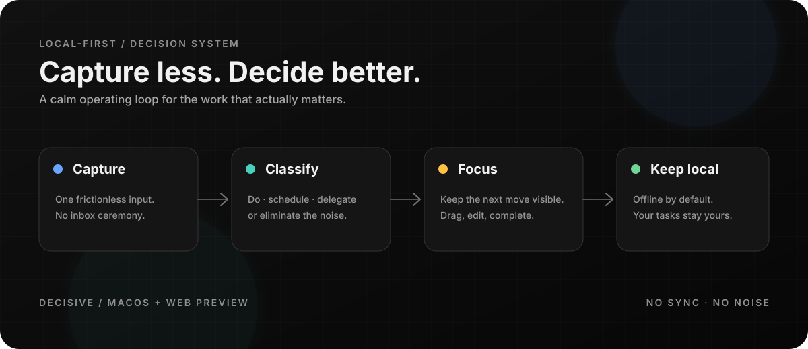
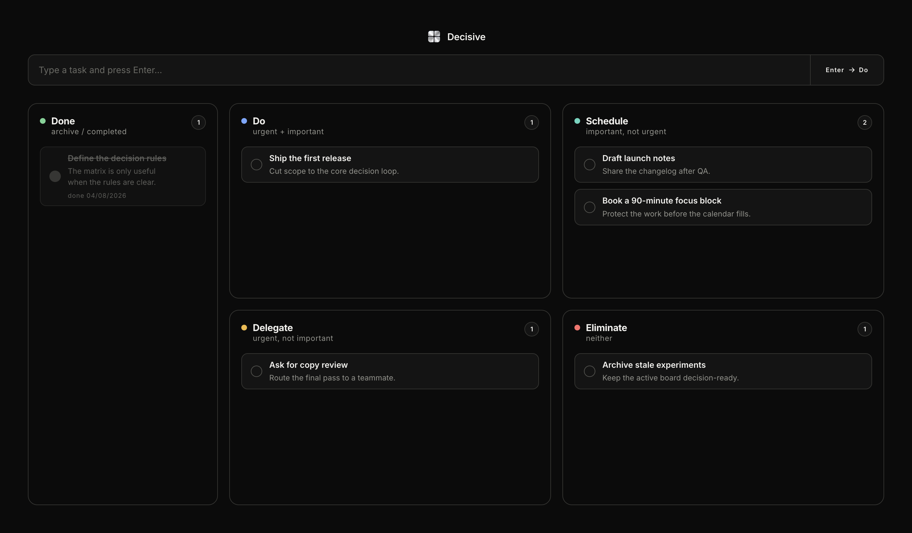

<div align="center">
  
  <h1>Decisive</h1>
  <p><strong>A local-first decision matrix for the work that matters.</strong></p>
  <p>Capture a task, place it by consequence, and keep the next move visible — offline, private, and fast.</p>
</div>

<p align="center">
  
</p>

## The interface

Decisive turns the Eisenhower method into a focused workspace: one capture field, four consequence quadrants, a completed archive, and enough motion to make reclassification feel immediate without turning the board into a dashboard.

<table>
  <tr>
    <td width="70%"></td>
    <td width="30%"></td>
  </tr>
</table>

## What makes it different

- **Local-first by design.** Tasks live in a JSON file on your Mac. No account, cloud dependency, or sync layer is required.
- **Fast capture.** Type once, press Enter, and the task lands in **Do**.
- **Consequence over color.** Blue, teal, yellow, red, and green accents make the matrix scannable without competing with the task text.
- **Direct manipulation.** Drag tasks between quadrants, edit in place, mark complete, or delete with a deliberate two-step confirmation.
- **Responsive on purpose.** The same UI adapts to a narrow iPhone-sized preview and a native macOS window.
- **Animated, but considerate.** The ASCII background is tuned as atmosphere: it pauses when the app is hidden or unfocused and avoids stealing attention from the board.

## Run it locally

```bash
npm install
npm start
```

The local server runs at `http://127.0.0.1:4321`. For the native app during development:

```bash
npm run app
```

## Build the macOS app

```bash
npm run dist
open dist/mac-arm64/Decisive.app
```

The packaged app stores its persistent task history in macOS Application Support. The repository’s `data.json` is intentionally ignored because local task history is private.

## Capture the README previews

The screenshots above are generated from the actual UI with a sanitized fixture:

```bash
PORT=4323 DATA_FILE=examples/demo-data.json npm start
npm run capture:readme
```

That produces a desktop capture and a 390×844 iPhone preview in `docs/images/`.

## Verify it

```bash
npm test
npx electron test/scroll.test.cjs
```

The first command runs the API checks. The scroll test expects a Decisive server to be available on port `4321` and verifies the pinned bottom fade, gradient mask, and fixed matrix geometry. The UI smoke test can be run against a temporary fixture with `TEST_TASK_ID=<id> npx electron test/ui.test.cjs`.

## Project map

```text
index.html                 interface structure
style.css                  responsive visual system
app.js                     task interactions and persistence calls
server.js                  tiny local HTTP API
main.cjs                   native macOS shell
ascii-background.js        performance-aware ASCII atmosphere
examples/demo-data.json    safe fixture for screenshots
scripts/capture-readme-shots.cjs
                            reproducible README captures
```

## Status

Decisive is a focused personal productivity tool under active design iteration. The macOS app is the canonical offline build; the browser preview exists for fast annotation and responsive checks.
