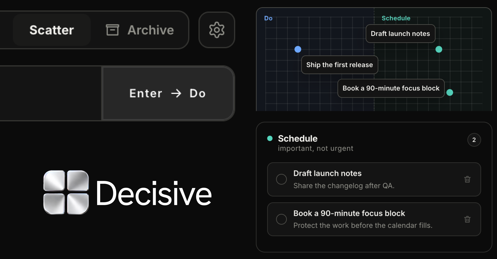
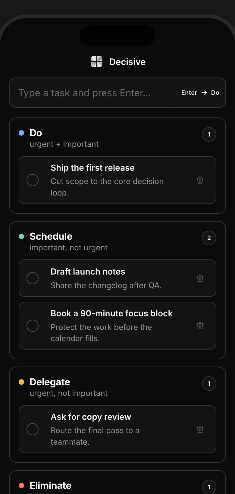

<div align="center">
  <h1>Decisive</h1>
  <p><strong>A local-first decision matrix for the work that matters.</strong></p>
  <p>Capture a task, place it by consequence, and keep the next move visible — focused, private, and fast.</p>
</div>

<p align="center">
  <video src="docs/media/decisive-demo.mp4" controls muted loop playsinline width="100%">
    <a href="docs/media/decisive-demo.mp4">Watch the Decisive product demo</a>
  </video>
</p>

## The interface

Decisive turns the Eisenhower method into a focused workspace: one capture field, four consequence quadrants, a completed archive, and enough motion to make reclassification feel immediate without turning the board into a dashboard.

<table>
  <tr>
    <td width="70%"></td>
    <td width="30%"></td>
  </tr>
</table>

## What makes it different

- **Local-first by design.** Tasks live in a JSON file on your Mac. No account, cloud dependency, or sync layer is required.
- **Fast capture.** Type once, press Enter, and the task lands in **Do**.
- **Consequence over color.** Blue, teal, yellow, red, and green accents make the matrix scannable without competing with the task text.
- **Direct manipulation.** Drag tasks between quadrants, edit in place, mark complete, or delete with a deliberate two-step confirmation.
- **Responsive on purpose.** The same UI adapts to a narrow iPhone-sized preview and a native macOS window.
- **Animated, but considerate.** The ASCII background is tuned as atmosphere: it pauses when the app is hidden or unfocused and avoids stealing attention from the board.

## Public web preview

[Open the Decisive web preview](https://decisive-three.vercel.app/)

The web preview exists so people can experience Decisive’s layout, visual language, and normal task interactions in a browser: capture a task, move it between quadrants, complete it, explore Scatter, and try the archive flow. It is a safe demo surface seeded with design-product work and is not the canonical task store. Browser preview changes are session-scoped and may reset when the preview sleeps or redeploys.

Persistent saveability, offline use, and continuity of tasks across restarts are available in the native macOS app below.

## Download the macOS app

[Download the latest Decisive macOS release](https://github.com/derinbarutcu17/decisive/releases/latest)

The macOS app is the canonical Decisive experience. It keeps task history locally in macOS Application Support, works offline, and preserves your data when the app is closed or updated.

Releases are currently unsigned because Decisive is not enrolled in the Apple Developer Program. On first launch, macOS may show a security warning:

1. Download the latest `.dmg` or `.zip` from the release page and move **Decisive** to `Applications`.
2. If macOS blocks the first launch, open **System Settings → Privacy & Security**.
3. Find the message that Decisive was blocked and choose **Open Anyway**, then confirm the prompt. You can also Control-click the app in `Applications`, choose **Open**, and confirm once.

Do not disable Gatekeeper globally. Only approve the copy downloaded from the official Decisive release page.

New tagged releases are packaged automatically by [`.github/workflows/release.yml`](.github/workflows/release.yml) and published to GitHub Releases.

## Run it locally

```bash
npm install
npm start
```

The local server runs at `http://127.0.0.1:4321`. For the native app during development:

```bash
npm run app
```

## Build the macOS app

```bash
npm run dist
open dist/mac-arm64/Decisive.app
```

The packaged app stores its persistent task history in macOS Application Support. The repository’s `data.json` is intentionally ignored because local task history is private.

## Capture the README previews

The screenshots above are generated from the actual UI with a sanitized fixture:

```bash
PORT=4323 DATA_FILE=examples/demo-data.json npm start
npm run capture:readme
```

That produces a desktop capture and a 390×844 iPhone preview in `docs/images/`.

## Verify it

```bash
npm run verify
```

`npm test` remains the fast deterministic unit/static check. `npm run verify` also starts an isolated fixture server and runs the scatter, scroll, layout, label, and UI smoke suites against it. Personal task data is never used by verification.

For a release, CI additionally checks the tag/version match and generates `dist/SHA256SUMS.txt` alongside the macOS artifacts.

## Project map

```text
index.html                 interface structure
style.css                  responsive visual system
app.js                     task interactions and persistence calls
server.js                  tiny local HTTP API
main.cjs                   native macOS shell
ascii-background.js        performance-aware ASCII atmosphere
examples/demo-data.json    safe fixture for screenshots
scripts/capture-readme-shots.cjs
                            reproducible README captures
```

## Status

Decisive is a focused personal productivity tool under active design iteration. The macOS app is the canonical offline build; the browser preview exists for fast annotation and responsive checks.
